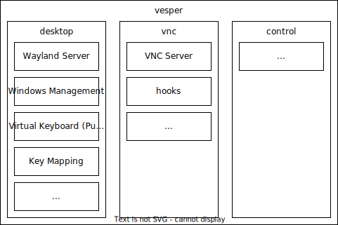

# Vesper: 落霞合成器

## 姊妹项目

### vesper 核心

Wayland 图形合成器 & 窗口管理；VNC 远程桌面服务器。

[https://github.com/FlowerBlackG/vesper](https://github.com/FlowerBlackG/vesper)

### vesper 启动器

通过 domain socket 向刚登录的用户账户发送程序启动指令。

[https://github.com/FlowerBlackG/vesper-launcher](https://github.com/FlowerBlackG/vesper-launcher)

### vesper 中央服务

为前端操作台提供服务，控制 vesper 启动器与 vesper 核心工作。

[https://github.com/FlowerBlackG/vesper-center](https://github.com/FlowerBlackG/vesper-center)

### vesper 前端操作台

用户的操作界面。

[https://github.com/FlowerBlackG/vesper-front](https://github.com/FlowerBlackG/vesper-front)

## 简介

落霞是一款基于 wlroots 的 Wayland 合成器与窗口管理器，支持用 VNC 协议将画面传送到远程桌面。可作为虚拟实验平台的组件。

该项目为作者毕业设计项目的一部分。

## 整体结构

## 参考

* \[1\] Drew DeVault. The Wayland Protocol. [https://wayland-book.com/](https://wayland-book.com/)
* \[2\] Kristian Hogsberg. The Wayland Protocol. 2012. [https://wayland.freedesktop.org/docs/html/](https://wayland.freedesktop.org/docs/html/)
* \[3\] T. Richardson & J. Levine. The Remote Framebuffer Protocol. [https://datatracker.ietf.org/doc/html/rfc6143](https://datatracker.ietf.org/doc/html/rfc6143)
* \[4\] Introduction to wlroots. [https://way-cooler.org/book/wlroots_introduction.html](https://way-cooler.org/book/wlroots_introduction.html)
* \[5\] wlroots – A modular Wayland compositor library. [https://gitlab.freedesktop.org/wlroots/wlroots](https://gitlab.freedesktop.org/wlroots/wlroots)
* \[6\] swaywm. sway – i3-compatible Wayland compositor. [https://github.com/swaywm/sway](https://github.com/swaywm/sway)
* \[7\] any1. wayvnc – A VNC server for wlroots based Wayland compositors. [https://github.com/any1/wayvnc](https://github.com/any1/wayvnc)
* \[8\] pixman – Image processing and manipulation library. [https://gitlab.freedesktop.org/pixman/pixman](https://gitlab.freedesktop.org/pixman/pixman)
* \[9\] wlroots. tinywl. [https://gitlab.freedesktop.org/wlroots/wlroots/-/tree/master/tinywl](https://gitlab.freedesktop.org/wlroots/wlroots/-/tree/master/tinywl)
* \[10\] Wayland. weston – A lightweight and functional Wayland compositor. [https://gitlab.freedesktop.org/wayland/weston](https://gitlab.freedesktop.org/wayland/weston)
* [11] [码农飞飞](https://blog.csdn.net/yang1fei2 "码农飞飞"). 使用libvncserver库快速搭建VNC服务端. [https://blog.csdn.net/yang1fei2/article/details/132371918](https://blog.csdn.net/yang1fei2/article/details/132371918)
* [12] X Consortium. X Window System Protocol. The Open Group, 2004
